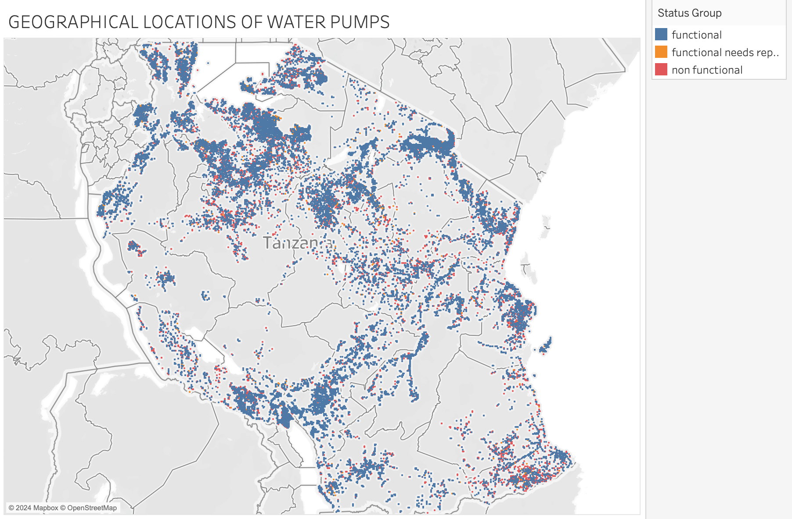

# Water Pump Status Predictions in Tanzania

Tanzania is a third world country. As of 2024 December, the country has a population of 67.44 million people. As with many third wold countries, access to clean water is a major challenge. Through both public and private participation, the country has been able to install water pumps across the country. Unforturnetly, a number of these water points require repairs or are completely not functional. 

Alot of factors affect the functionality/availablity of the water points including:
1. Geographical Loction
2. Environmental conditions
3. Water pump specifications
4. Maintenance schedules
5. Water quality

The aim of this project is to develop various machine learning models using different techniques. The models will help to categorise the water points into 3 different groups:

1. Functional
2. Non-Functional
3. Requires Repair

The stakeholders for this project include:

1. Government of Tanzania
2. NGOs in the country
3. Private Limited Companies

With this classification, the stakeholders can take corrective action to improve the situation. The results will significantly increase the effeciency of the implementation plan as the associated parties will be able to: 

1. Introduce preventative maintanance
2. Create an effective resource allocation plan
3. Improve future water points installations

The project hopeful will lead to an increase in socio-economice development in Tanzania by ensuring sustainability through clean water sources across the country. 

### Data Understanding

The data onsists of three CSV files: a training dataset with 59,400 records (80% of the data), a test dataset with 14,850 records (20%), and a third file containing the labels for the training data, which categorize each pump’s status as either “functional,” “non-functional,” or “in need of repairs.” Both the training and test datasets feature 40 columns with similar attributes, including details on pump location, construction, management, payment methods, and water quality in Tanzania.
Data source: [www.drivendata.org](www.drivendata.org)

First step is to import the required libraries for the project and load the csv files that contain the data.

From my analysis of this dataset, the irrelevant columns are:

- wpt_name: Name of the waterpoint (not relevant for our analysis).
- num_private: Number of private pumps (not relevant for our analysis).
- subvillage: Subvillage location (not relevant for our analysis).
- district_code: District code (not relevant for our analysis).
- lga: Local government authority (not relevant for our analysis).
- ward: Administrative ward (not relevant for our analysis).
- public_meeting: Whether there was a public meeting related to the waterpoint (not relevant for our analysis).
- recorded_by: Entity recording the data (not relevant for our analysis).
- scheme_name: Name of the waterpoint scheme (not relevant for our analysis).
- extraction_type_group: Grouped extraction type (redundant with 'extraction_type').
- extraction_type_class: Classification of extraction type (redundant with 'extraction_type').
- management_group: Grouped management type (redundant with 'management').
- payment_type: Payment method (redundant with 'payment').
- quality_group: Grouped water quality (redundant with 'water_quality').
- quantity_group: Grouped water quantity (redundant with 'quantity').
- source_type: Source type (redundant with 'source').
- source_class: Source class (redundant with 'source').
- waterpoint_type_group: Grouped waterpoint type (redundant with 'waterpoint_type').

As a result, we shall drop them.

### Data Visualisation

The plot shown below displays the percentage distrubution of the water pumps with regards to their functionality status:

The geographical locations of the water pumps are shown below. They have been color coded with reference to their functionality status:

After isolating just the non-functional water pumps, we can see how they are distributed across the country

Water Quality vs Status Group:

A correlation matrix helps us understand the relationship between different features in the dataset. Shown below:

The regional distribution of water pumps is shown below

### Tabluea Dashboard

https://public.tableau.com/app/profile/victor.kigen3018/viz/VKIGEN-DSC-PHASE-3-PROJECT-TANZANIA-WATER-PUMPS-ANALYSIS/TanzaniaWaterPumpsanalysis?publish=yes

### Modeling

In order to design and build a logistict regression model, we first need to identify:

<b>1. Target Variable</b>

Considering the stated task is to building a classifier to predict the condition of a water well, our target variable would be the `status_group`. This column displays the condition of the water well.

<b>2. Independent Variables (Features)</b>

The water pump is affected by a magnitude of features. The numerical features are as follows: 

- `amount_tsh`
- `gps_height`
- `longitude`
- `latitude`
- `population`
- `age`
- `population`
- `district_code`

Categorical features include: 

- `funder`
- `installer`
- `basin`
- `region`
- `scheme_management`
- `permit`
- `extraction_type`
- `management`
- `payment`
- `water_quality`
- `source`

In order to use a categorical variable in a model, we'll create multiple dummy variables, one for each category of the categorical variable. This method, known as one hot encoding enables us to convert the data into binary vectors.

Once we've performed the one hot encoding, we can go ahead and split the data into two sets. One for training and one for testing. 

### Logistic Regression Models:

Initial model gave us an accuracy of Upon creating the first model, the results are shown below:

The output from the classification report and confusion matrix suggests that your model is not performing well on the minority classes (specifically, "functional needs repair" and "non functional"). This is a common issue in imbalanced datasets. In order to solve this we can:

Resampling techniques like SMOTE (Synthetic Minority Over-sampling Technique) to balance the class distribution. After performing this technique, we get the following results: 

### 2. Random Forest Classification Model

The best parameters for the model are determined through a grid search, with the following results:

Max Depth: 20
Min Samples Split: 20
Min Samples Leaf: 1
The best accuracy achieved by the model is 75.08%.

Confusion matrix is shown below:

## Evaluation

### Regression Models:

The initial regression model achieved an accuracy of 63.4%, but struggled with class imbalance, particularly in predicting minority classes. Applying SMOTE improved the model's performance on these classes by generating synthetic samples, but this led to a decrease in overall accuracy to 50.7%. This suggests a trade-off between improving predictions for underrepresented classes and maintaining performance on the majority class. The model's inability to balance both accuracy and minority class prediction highlights the challenge of working with imbalanced datasets. Exploring alternative techniques, such as adjusting class weights or using ensemble methods, may help better address this imbalance and improve the model’s overall effectiveness.

### Decision Tree Models:

The Decision Tree model achieved an accuracy of 75.08%, which outperformed the best-performing regression model. This suggests that Decision Trees are more adept at capturing the patterns in the dataset compared to linear regression models, especially when there is non-linearity or complex interactions between features.

One of the key strengths of Decision Trees lies in their interpretability. Unlike many machine learning models, Decision Trees provide a clear and intuitive representation of decision-making processes. This makes them an excellent choice when stakeholders need to understand how the model arrives at its predictions.

## Recommendations:

Recommendations to Improve Waterpoint Maintenance in Tanzania:

<b>Commit to Continuous Data Collection:</b>

- Establish continuous data collection to improve the performance of predictive models and support proactive maintenance of waterpoints.

<b> Use Decision Tree Models:</b>

- Decision Tree Models have proven to be more effective than regression models in predicting waterpoint conditions.
- Resources should be focused on further enhancing and deploying this model for practical use.

<b>Enhance Pump Reliability and Data Collection:</b>

- Direct resources towards high-risk waterpoints in need of repairs or maintenance.
- Invest in more durable pump types and collaborate with local governments to improve data collection and optimize maintenance operations.

<b>Strengthen Government Oversight and Partnerships:</b>

- Implement regulatory oversight to ensure wells are constructed at the correct depths and standards.
- Work with NGOs to create a fund or organization focused on reviewing and repairing aging wells.

<b>Address Financial Challenges:</b>

- Recognize the financial burden of maintenance, especially in light of the average monthly income in Tanzania.
- Develop financial support systems, such as subsidies from local governments or districts, to assist with maintenance costs and ensure a sustainable water system.